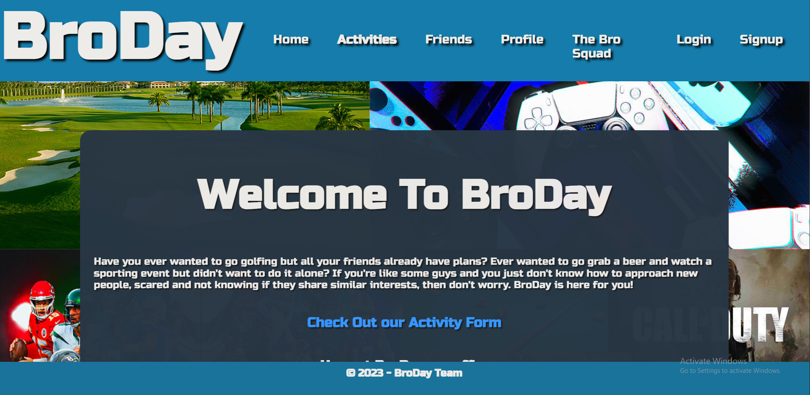
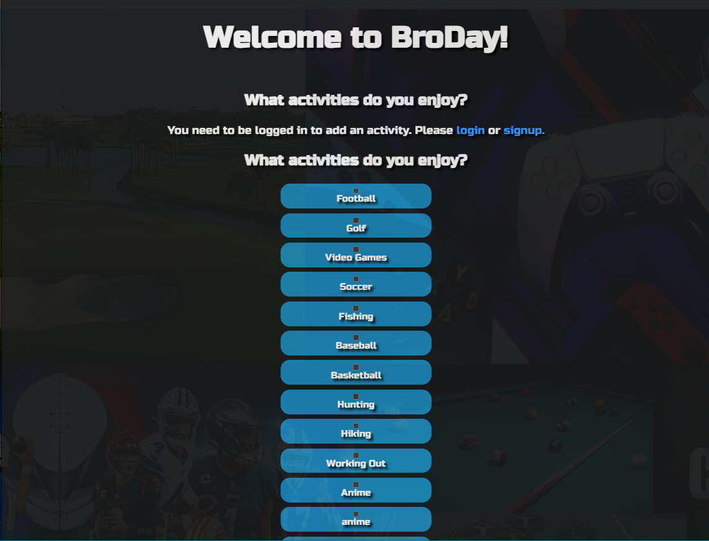
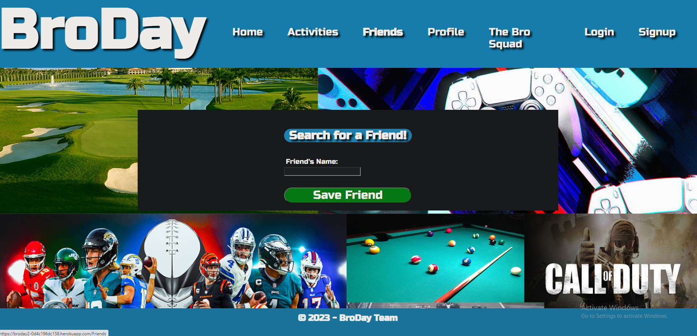

# BroDay

## Table of Contents 

- [Description](#description)
- [Usage](#usage)
- [Images](#images)
- [Contributors](#contributors)
- [Link](#link)

## Description
Have you ever wanted to go golfing but all your friends already have plans? Ever wanted to go grab a beer and watch a sporting event but didn't want to do it alone? If you're like some guys and you just don't know how to approach new people, scared and not knowing if they share similar interests, then don't worry. BroDay is here for you!

Technologies Used 
- React.js
- Bootstrap 5 
- Express and Node
- Graphql
- JWT
- Bcrypt
- Bulma
- Multer 
- Mongoose
- Apollo

## Usage
Create an account to meet new bros. Add activites to your profile from the activty list or submit your own. go to the friends page and search for a user's name to add them to your friends list. view your activites on you profile and view friend's profile.
## Images

## Link 
https://broday2-0d4c196dc158.herokuapp.com/

## Contributors
- Peter Conenna (https://github.com/pconenna)
- Andrew Forbes (https://github.com/AndrewJMForbes)
- North Goddard (https://github.com/northgoddard)
- Teylor Smith (https://github.com/teylorsmith34)